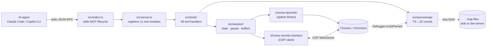
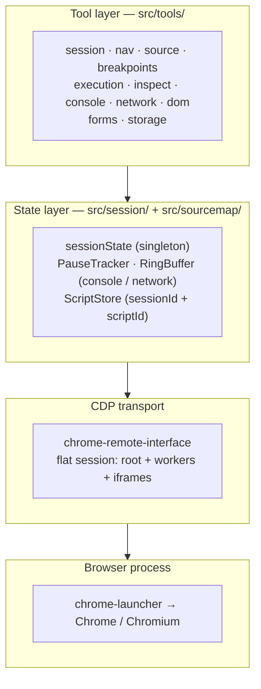
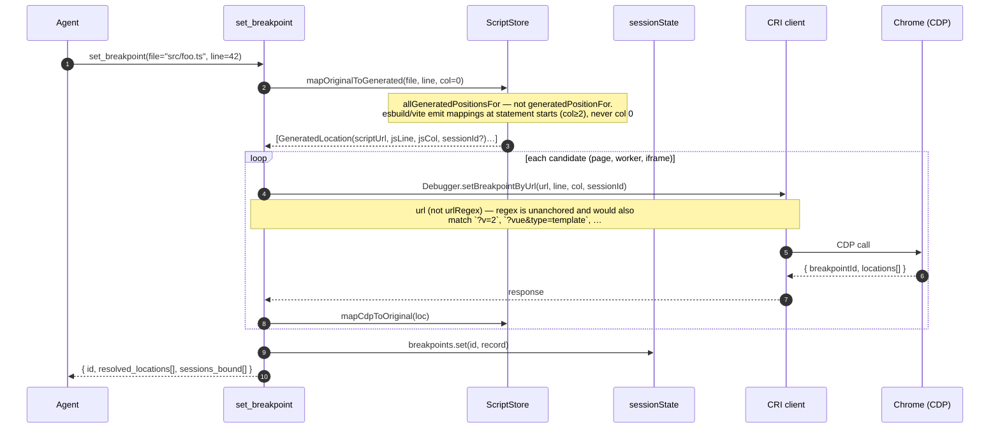
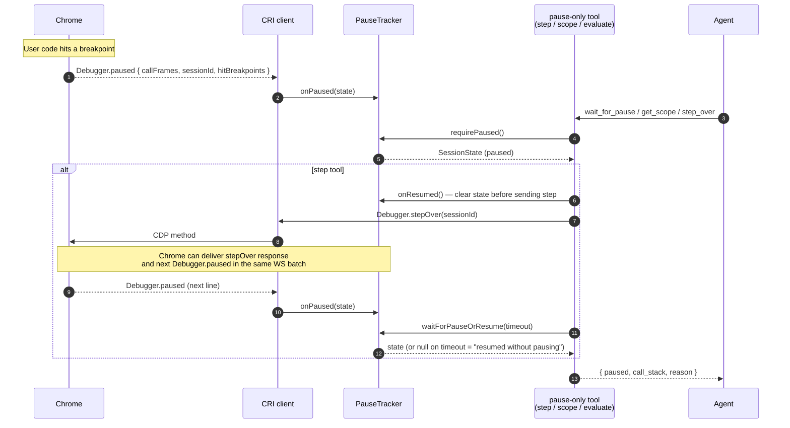
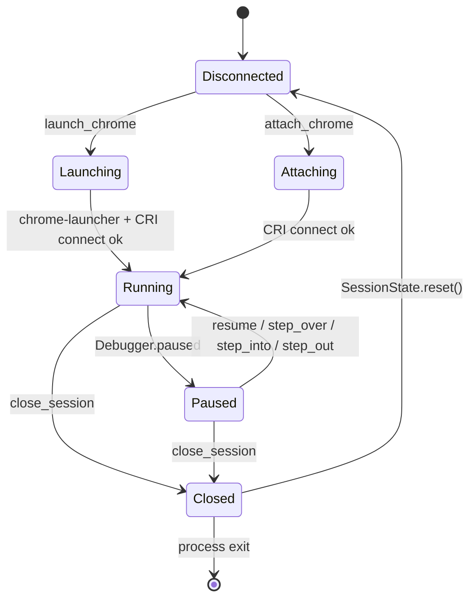
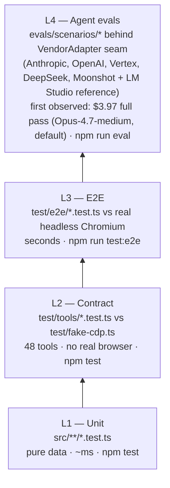

# Architecture

**Last updated: 2026-06-09**

How `cdp-mcp` is put together. For *why* decisions were made the way they were, see [design-notes.md](./design-notes.md) — especially its "What the implementation discovered" section. For test-pyramid depth + 11 critical gotchas, see [test-eval-plan.md](./test-eval-plan.md).

## At a glance

`cdp-mcp` is a stdio MCP server. An AI agent (Claude Code, Copilot CLI, …) launches it as a subprocess, sends MCP `tools/call` requests, and the server proxies them to a real Chrome/Chromium process through the Chrome DevTools Protocol (CDP). The server is **TS-aware**: coordinates the agent sends and receives are in TypeScript source (1-based lines, 0-based columns), translated to/from generated JS via the source maps Chrome already loads when it parses the bundle.

Three big pieces:

- A **tool layer** (`src/tools/`) — 48 thin handlers wrapping CDP calls with Zod schemas + a structured error envelope.
- A **state layer** (`src/session/` + `src/sourcemap/`) — owns the singleton Chrome process, the CDP client, the pause tracker, ring buffers, and the script store / source-map indexes.
- A **CDP transport** (`chrome-remote-interface`) — the WebSocket to Chrome, with flat sessions for the root page + every attached worker/iframe.

## Component diagram

## Layered view

## Module map

| Directory | Files | Responsibility | Component README |
|---|---|---|---|
| [`src/`](../src/) | `index.ts`, `server.ts`, `contract.ts`, `locator.ts` | Entry + server wiring + published `cdp-mcp/contract` (LocatorSpec) | — |
| [`src/session/`](../src/session/) | `state.ts`, `browser.ts`, `pause.ts`, `buffers.ts` | Singleton lifecycle, pause state, ring buffers | [README](../src/session/README.md) |
| [`src/sourcemap/`](../src/sourcemap/) | `store.ts`, `loader.ts`, `normalize.ts` | TS↔JS coordinate translation, script indexing | [README](../src/sourcemap/README.md) |
| [`src/tools/`](../src/tools/) | 11 tool files + `_register.ts` + `_locator_runtime.ts` | 48 MCP tool implementations | [README](../src/tools/README.md) |
| [`src/util/`](../src/util/) | `errors.ts`, `format.ts`, `log.ts` | `ToolError`, preview/truncate helpers, structured stderr logging | — |

## Request flow — `set_breakpoint`

The canonical TS-aware path. The agent thinks in TS coordinates; the server resolves the source map and binds in every script that maps back to that file (including workers and iframes).

## Pause / step lifecycle

`PauseTracker` is the source of truth for "are we paused?" Tools that require a pause (`get_scope`, `get_call_stack`, `evaluate` with `frame_index`, the step tools) gate through `requirePaused()`. Step tools have a tricky interaction with CRI's synchronous event emission — see the entry-guard comment in `src/session/pause.ts` `waitForPauseOrResume()`.

## Session state machine

`closeSession()` kills Chrome **only** when we `launch_chrome`'d it ourselves; an `attach_chrome` session leaves the user's Chrome running (`sessionState.attached === true`).

## Test pyramid

The full 4-layer strategy lives in [test-eval-plan.md](./test-eval-plan.md) — 338 lines and all worth reading. The shape:

## External boundaries

What this code talks to:

- **CDP** (`chrome-remote-interface`) — WebSocket to Chrome. `Debugger.*`, `Page.*`, `Runtime.*`, `Network.*`, `DOM.*`, `Input.*`, `IO.*`, `Target.*`. Auto-attaches to workers + iframes via `Target.setAutoAttach({ flatten: true })`.
- **`chrome-launcher`** — spawns Chrome with `--remote-debugging-port`; cross-platform binary detection (`chrome_path` arg overrides).
- **File system** — TypeScript source files + source maps. Source maps are loaded **lazily** on `Debugger.scriptParsed` (`src/sourcemap/loader.ts` — browser-first via `Network.loadNetworkResource` to inherit auth/cookies/dev-server middleware, Node `fetch` fallback for plain localhost).
- **MCP stdio JSON-RPC** — talks to the agent (Claude Code, Copilot CLI). Stdout is reserved for the MCP protocol; logs go to stderr (see `src/util/log.ts`).
- **LLM SDKs (`@anthropic-ai/sdk`, `@google/genai`) + raw-fetch OpenAI-compatible clients** — used **only** by the L4 evals, behind the `VendorAdapter` seam (`evals/harness/vendor.ts` defines the interface). Adapters: `anthropic.ts`, `openai-adapter.ts` / `openai-responses-adapter.ts` / `openai-compat-adapter.ts`, `vertex-adapter.ts` (`@google/genai`), `deepseek-adapter.ts`, `moonshot-adapter.ts`, and the `lm-studio-adapter.ts` local reference. The production server has no LLM dependency.

## Where to go next

- Component depth → the 5 component READMEs (module-map table above).
- Design rationale + post-implementation gotchas → [design-notes.md](./design-notes.md).
- Test/eval depth + 11 critical gotchas → [test-eval-plan.md](./test-eval-plan.md).
- Chromium-vs-Chrome differences + host-OS workarounds → [known-chromium-gaps.md](./known-chromium-gaps.md).
- Current branch / PR / issue state → [../AGENTS.md](../AGENTS.md).
