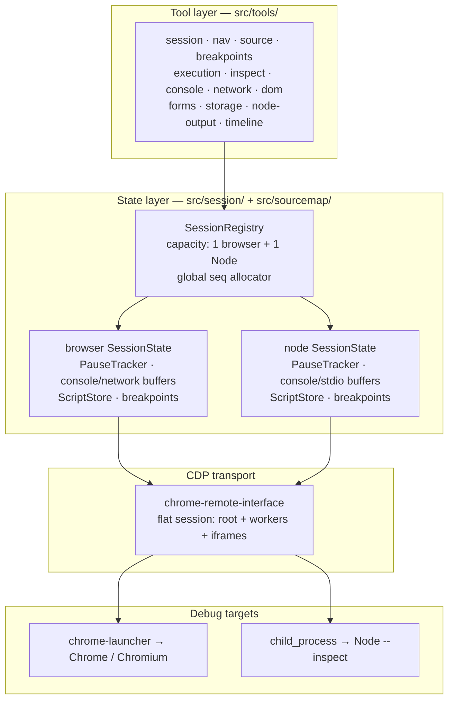
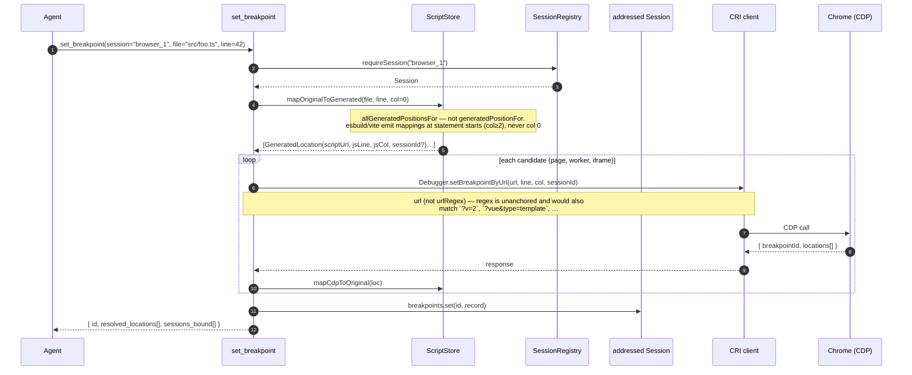
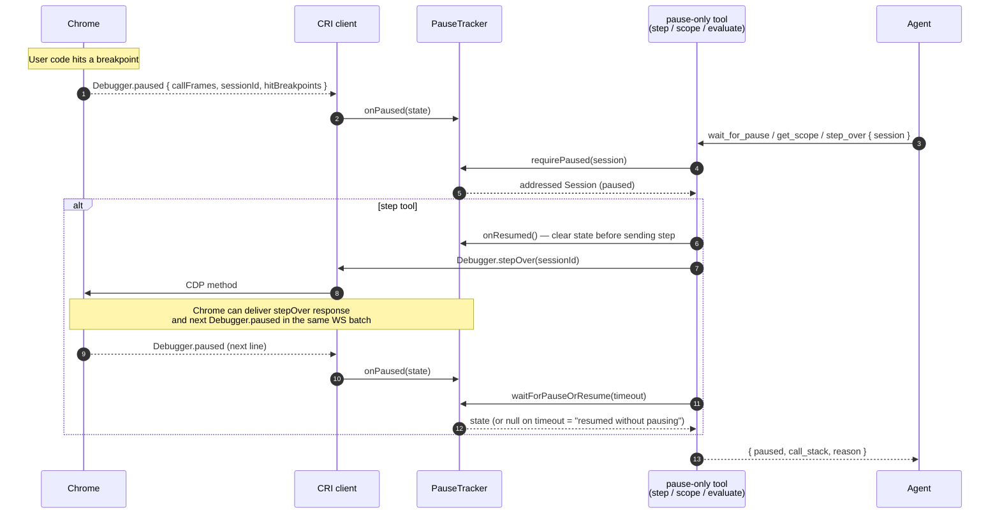
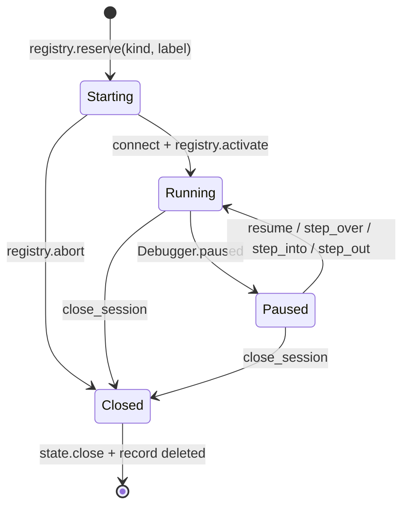
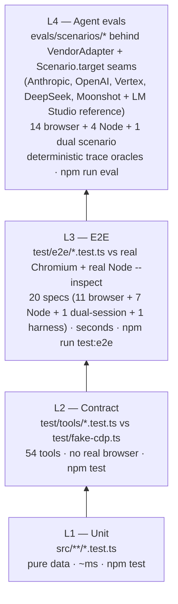

# Architecture

**Last updated: 2026-07-23**

How `lynceus` is put together. For *why* decisions were made the way they were, see [design-notes.md](./design-notes.md) — especially its "What the implementation discovered" section. For test-pyramid depth + 11 critical gotchas, see [test-eval-plan.md](./test-eval-plan.md).

## At a glance

`lynceus` is a stdio MCP server. An AI agent (Claude Code, Copilot CLI, …) launches it as a subprocess, sends MCP `tools/call` requests, and the server proxies them to real Chrome/Chromium and Node Inspector targets through the Chrome DevTools Protocol (CDP). The server is **TS-aware**: coordinates the agent sends and receives are in TypeScript source (1-based lines, 0-based columns), translated to/from generated JS via each target's source maps.

Three big pieces:

- A **tool layer** (`src/tools/`) — 54 thin handlers wrapping CDP calls with Zod schemas + a structured error envelope.
- A **state layer** (`src/session/` + `src/sourcemap/`) — a `SessionRegistry` can own one browser record and one Node record concurrently. Each record has its own CDP client, pause tracker, breakpoints, ring buffers, and source-map index; one registry-global sequence allocator orders buffered events across records.
- A **CDP transport** (`chrome-remote-interface`) — the WebSocket to Chrome (root page + every attached worker/iframe via `flatten:true` auto-attach) or to a Node `--inspect` endpoint (single root target).

## Component diagram

```mermaid
flowchart LR
    Agent["AI agent<br/>Claude Code / Copilot CLI"]
    Index["src/index.ts<br/>stdio MCP lifecycle"]
    Server["src/server.ts<br/>registers 13 tool modules"]
    Tools["src/tools/<br/>54 tool handlers"]
    Registry["SessionRegistry<br/>browser_N + node_N"]
    BrowserState["browser Session<br/>pause · maps · buffers"]
    NodeState["node Session<br/>pause · maps · buffers"]
    Sourcemap["src/sourcemap/<br/>TS↔JS coords"]
    CRI["chrome-remote-interface<br/>(CDP client)"]
    Launcher["chrome-launcher<br/>(spawn binary)"]
    Chrome[("Chrome / Chromium")]
    Node[("Node --inspect")]
    Maps[(".map files<br/>disk or dev-server")]

    Agent -- "stdio JSON-RPC" --> Index
    Index --> Server
    Server --> Tools
    Tools --> Registry
    Tools --> Sourcemap
    Registry --> BrowserState
    Registry --> NodeState
    BrowserState --> CRI
    NodeState --> CRI
    BrowserState --> Launcher
    Launcher --> Chrome
    CRI <-- "CDP WebSocket" --> Chrome
    CRI <-- "Inspector WebSocket" --> Node
    Chrome -. "Debugger.scriptParsed" .-> Sourcemap
    Node -. "Debugger.scriptParsed" .-> Sourcemap
    Sourcemap -. "lazy fetch" .-> Maps
```

## Layered view

## Browser vs Node session kinds

A registry record is either a **browser** target (Chrome / Chromium via `chrome-launcher` or a `--remote-debugging-port` attach) or a **Node Inspector** target (Node `--inspect` / `--inspect-brk`). One of each kind may be live concurrently. The record's `kind` gates the tool surface:

- Both kinds share the Runtime + Debugger surface — breakpoints, stepping, pause, scope, evaluate, console reads, source maps. The `connectDebugger` helper in `src/session/debugger.ts` is shared.
- Browser-only domains (`Page`, `DOM`, `Input`, `Network`) are not enabled in Node sessions. The 25 browser-only MCP tools return the structured error envelope `{ error: "unsupported_target", message: "Tool <name> requires a browser session (current session is node)" }` when called against a Node session. The reverse holds for `get_node_output`, which targets a Node-only surface and returns `{ error: "unsupported_target", message: "Tool get_node_output requires a node session (current session is browser)" }` when called against a browser session. The lookup table lives in `src/session/capabilities.ts` (see [`src/tools/README.md`](../src/tools/README.md) §Capability gating).
- Lifecycle plumbing differs: browser sessions go through `chrome-launcher` (or a port attach) and `Target.setAutoAttach({ flatten: true })` to fan out to workers + iframes. Node sessions use `child_process.spawn` (for `launch_node`) or a direct CDP connect to the inspector websocket (for `attach_node`), and remain single-target — no child sessions in v1 (Worker-threads auto-attach is deferred per [`node-session-design.md`](./node-session-design.md) §9).

The session-mode design itself is locked in at [`node-session-design.md`](./node-session-design.md).

Debug-target addressing is independent from CDP flat-session provenance. `session`
selects a registry record (`browser_1` / `node_1`); `session_id` selects a worker,
iframe, or OOPIF inside the chosen browser record (`null` means its root). Omitting
`session` resolves the sole live record, but returns `ambiguous_session` when both kinds
are live. See [`dual-target-debugging.md`](./dual-target-debugging.md) for the full
contract.

## Module map

| Directory | Files | Responsibility | Component README |
|---|---|---|---|
| [`src/`](../src/) | `index.ts`, `server.ts`, `contract.ts`, `locator.ts` | Entry + server wiring + published `lynceus/contract` (LocatorSpec) | — |
| [`src/framework/`](../src/framework/) | `adapter.ts`, `react.ts` | Stateless framework resolution seam (React-only in v1); mutable bridge/runtime state remains per addressed `SessionState` | [React DevTools design](./react-devtools-design.md) |
| [`src/session/`](../src/session/) | `state.ts`, `browser.ts`, `node.ts`, `debugger.ts`, `capabilities.ts`, `pause.ts`, `buffers.ts` | `SessionRegistry`, transactional lifecycle, per-record pause/maps/buffers, registry-global sequencing; browser + Node kinds share `connectDebugger` | [README](../src/session/README.md) |
| [`src/sourcemap/`](../src/sourcemap/) | `store.ts`, `loader.ts`, `normalize.ts` | TS↔JS coordinate translation, script indexing; kind-aware source-map fetch (browser via `Network.loadNetworkResource`, Node via `file://` on loopback only) | [README](../src/sourcemap/README.md) |
| [`src/tools/`](../src/tools/) | 13 tool files + `_register.ts` + `_session_input.ts` + `_locator_runtime.ts` | 54 MCP tool implementations across `session` / `nav` / `source` / `breakpoints` / `execution` / `inspect` / `console` / `network` / `dom` / `forms` / `storage` / `node-output` / `timeline` | [README](../src/tools/README.md) |
| [`src/util/`](../src/util/) | `errors.ts`, `format.ts`, `log.ts` | `ToolError`, preview/truncate helpers, structured stderr logging | — |

## Request flow — `set_breakpoint`

The canonical TS-aware path. The agent thinks in TS coordinates; the server resolves the source map and binds in every script that maps back to that file (including workers and iframes).

## Pause / step lifecycle

`PauseTracker` is the source of truth for "are we paused?" Tools that require a pause (`get_scope`, `get_call_stack`, `evaluate` with `frame_index`, the step tools) gate through `requirePaused()`. Step tools have a tricky interaction with CRI's synchronous event emission — see the entry-guard comment in `src/session/pause.ts` `waitForPauseOrResume()`.

## Registry and per-session state machines

Registry startup is `reserve → initialize → activate`; failure calls
`abort(record)` so a half-built target is never visible and never consumes capacity
permanently. IDs are monotonic per kind and labels are unique among live records.

`registry.closeAddressed()` kills the underlying process (Chrome or Node) **only** when lynceus launched it; an `attach_chrome` / `attach_node` record leaves the user's process running (`state.attached === true`). Shutdown fans out through `registry.closeAll()` and awaits every in-flight teardown.

`wait_for_pause({session})` is scoped. With both records live, omitting `session` races
cancellable waiters across the participants that existed at call start; the first pause
wins and loser waiters are removed. `get_timeline(session="all")` is the complementary
read path: console, browser-network request-start, and Node stdio rows share a
registry-global `seq`, so forward pagination preserves cross-target order.

## Test pyramid

The full 4-layer strategy lives in [test-eval-plan.md](./test-eval-plan.md). The shape:

## External boundaries

What this code talks to:

- **CDP** (`chrome-remote-interface`) — WebSockets to Chrome and Node Inspector. Browser records use `Debugger.*`, `Page.*`, `Runtime.*`, `Network.*`, `DOM.*`, `Input.*`, `IO.*`, and `Target.*`, auto-attaching to workers + iframes via `flatten:true`; Node records use the shared Runtime + Debugger subset.
- **`chrome-launcher`** — spawns Chrome with `--remote-debugging-port`; cross-platform binary detection (`chrome_path` arg overrides).
- **File system** — TypeScript source files + source maps. Source maps are loaded **lazily** on `Debugger.scriptParsed` (`src/sourcemap/loader.ts`). The fetch tier dispatches on session kind: **browser** sessions go through `Network.loadNetworkResource` to inherit auth/cookies/dev-server middleware (with a `fetch()` fallback for plain localhost); **Node** sessions have no `Network` domain, so `file://` source maps are read directly via `fs.readFile(fileURLToPath(url))` — gated to loopback inspector hosts only, so a remote-debugging session can't trick the loader into reading attacker-chosen local paths.
- **MCP stdio JSON-RPC** — talks to the agent (Claude Code, Copilot CLI). Stdout is reserved for the MCP protocol; logs go to stderr (see `src/util/log.ts`).
- **LLM SDKs (`@anthropic-ai/sdk`, `@google/genai`) + raw-fetch OpenAI-compatible clients** — used **only** by the L4 evals, behind the `VendorAdapter` seam (`evals/harness/vendor.ts` defines the interface). Adapters: `anthropic.ts`, `openai-adapter.ts` / `openai-responses-adapter.ts` / `openai-compat-adapter.ts`, `vertex-adapter.ts` (`@google/genai`), `deepseek-adapter.ts`, `moonshot-adapter.ts`, and the `lm-studio-adapter.ts` local reference. The production server has no LLM dependency.

## Where to go next

- Component depth → the component READMEs (module-map table above).
- Design rationale + post-implementation gotchas → [design-notes.md](./design-notes.md).
- Test/eval depth + 11 critical gotchas → [test-eval-plan.md](./test-eval-plan.md).
- Chromium-vs-Chrome differences + host-OS workarounds → [known-chromium-gaps.md](./known-chromium-gaps.md).
- Current branch / PR / issue state → [../AGENTS.md](../AGENTS.md).
