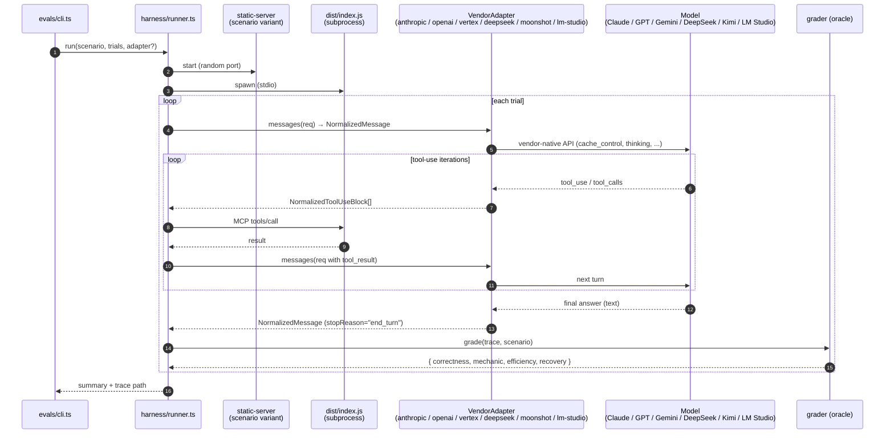

# evals/

**Last updated: 2026-06-09**

L4 of the test pyramid — runs Claude through scripted scenarios that exercise the full MCP tool surface end-to-end against a real browser. For pyramid context see [../docs/ARCHITECTURE.md §Test pyramid](../docs/ARCHITECTURE.md); for the cost model + caching guarantees see [../docs/test-eval-plan.md §L4](../docs/test-eval-plan.md).

## Layout

| Path | Role |
|---|---|
| `cli.ts` | Entry point. Parses `--scenarios=…` / `--trials=…` / budget flags. `resolveProviderClient()` picks a `VendorAdapter` from `EVAL_PROVIDER` (unset/`"anthropic"` → runner default; `"openai"` → `makeOpenaiAdapter()` for reasoning-off / `makeOpenaiResponsesAdapter()` for reasoning-on, auto-routed (#50/#58); `"vertex"` → `makeVertexAdapter()` for Gemini 3.x (#51); `"deepseek"`/`"moonshot"` → `makeDeepseekAdapter()`/`makeMoonshotAdapter()` (remote OpenAI-compat vendors, LEO-233); `"lm-studio"` → investigation artifact). Dispatches to the runner. |
| `harness/vendor.ts` | The vendor-agnostic seam (#47): `Vendor`, `VendorAdapter`, `NormalizedMessage`, `NormalizedThinkingBlock`, `VendorMessageRequest`, `ThinkingRequest`. The runner consumes only these shapes. |
| `harness/runner.ts` | Spawns a fresh `dist/index.js` MCP subprocess and the per-scenario static server, runs the tool-use loop against `adapter.messages(...)`, writes NDJSON traces, calls the oracle. Zero `@anthropic-ai/sdk` imports post-#47. |
| `harness/anthropic.ts` | Anthropic adapter — `makeAnthropicAdapter()`, request building (`buildAnthropicRequest`, `effectiveTokenCap`), and the `@internal` helpers (`splitAssistantContent`, `readCacheUsage`) kept exported for regression tests. Owns ephemeral cache markers on system prompt + tool list. |
| `harness/lm-studio-adapter.ts` | LM Studio (OpenAI-compatible) adapter — `makeLmStudioAdapter()`. Investigation artifact for issue #45 (still tagged NOT-FOR-MERGE in the header); post-#47 implements `VendorAdapter` directly, no `AnthropicClient` faking. |
| `harness/openai-compat-adapter.ts` | Shared OpenAI-compatible Chat Completions factory — `makeOpenAICompatAdapter()` (LEO-233 / GH #8). Backs the DeepSeek + Moonshot adapters; `max_tokens` (NOT `max_completion_tokens`), no Responses API. Parametrized by vendor tag / env-var names / default base URL, plus per-vendor `extraBody` (DeepSeek's `thinking` reasoning toggle) and `cacheTokensFrom` (cache accounting). Default per-request output cap is 32K so reasoning isn't truncated (GH #7). |
| `harness/deepseek-adapter.ts` | DeepSeek adapter — `makeDeepseekAdapter()` (LEO-233 / GH #8). Thin wrapper over the factory; reads `EVAL_DEEPSEEK_*`, defaults to `https://api.deepseek.com/v1`. Use the v4 model ids. Reasoning on via `thinking`:{type:enabled} + top-level `reasoning_effort:high` — `reasoning_content` captured to the `.thinking` sidecar AND re-fed on tool-call turns (V4 requires it echoed back, same as Kimi — verified vs the live API). Cache via top-level `prompt_cache_hit_tokens`. |
| `harness/moonshot-adapter.ts` | Moonshot (Kimi) adapter — `makeMoonshotAdapter()` (LEO-233). Thin wrapper over the factory; reads `EVAL_MOONSHOT_*`, defaults to the global `https://api.moonshot.ai/v1`. The eval `/v1` path — distinct from the Kimi Claude Code `/anthropic` setup. K2 reasons by server-side default; `reasoning_content` is captured AND re-fed (K2 hard-rejects a tool-call turn that omits it). Cache via `prompt_tokens_details.cached_tokens`. |
| `harness/vertex-adapter.ts` | Vertex (Gemini) adapter — `makeVertexAdapter()`. Direct `@google/genai` SDK with `vertexai: true` (NOT ADK, per the design doc). Explicit `cachedContents` lifecycle scoped per-trial via the `endScenario()` hook; thoughtSignature round-trips through `NormalizedThinkingBlock`'s vertex variant. Issue #51. |
| `harness/mcp-client.ts` | Bridges the Anthropic tool-use protocol to the MCP server's stdio JSON-RPC. |
| `harness/model.ts` | Default model (`claude-opus-4-8` + adaptive `medium` thinking), per-vendor pricing catalog (`PRICING_CATALOG` + `pricingFor(vendor, model)` post-#48; LM Studio wildcard `"*"` sentinel = $0; DeepSeek + Kimi rows added in LEO-233, each with an `inputCacheRead` bucket so `estimateCostUsd` credits the cache-read discount, GH #8), reasoning config, env overrides (`EVAL_MODEL_OVERRIDE`, `EVAL_REASONING_LEVEL`, `EVAL_REASONING_BUDGET`). |
| `harness/grader.ts` | Per-scenario oracle — emits `correctness ∈ {0,1}`, `mechanic ∈ {0,1}`, efficiency ratio, recovery count. No LLM judge. |
| `harness/trace.ts` | Trace serialization (NDJSON under `evals/runs/<run-id>/`). `readTraceFile` folds pre-#49 legacy shapes forward via `normalizeLegacyEntry`. |
| `harness/static-server.ts` | Tiny static server for the scenario's sample-app variant. |
| `harness/types.ts` | Shared types: `Scenario` (`name`, `variantDir`, `prompt`, `oracle`, `oracleMinimumToolCalls`, optional `systemPromptOverride`, optional `xfailCorrectness`), `TraceEntry` (NDJSON shape — `ScenarioStartEntry.provider`, `UsageEntry.cacheTokens` post-#49), `OracleResult`, `ReasoningConfig`, `TrialOutcome`. |
| `scenarios/index.ts` | Scenario registry — what `npm run eval` picks up. |
| `scenarios/<name>.ts` | One file per scenario: prompt, sample-app variant, oracle. |
| `scenarios/<name>.test.ts` | L1 unit tests for the scenario's oracle (no LLM, no browser). |
| `sample-app-variants/<name>/` | Per-scenario tweak of `examples/sample-app/` — each ships its own intentional bug. |

### Trace files per trial

Each trial produces one NDJSON file under `evals/runs/<run-id>/`:

- `<scenario>-<vendor>-<sanitized-model>-trial-<N>.ndjson` — the main trace (scenario_start, assistant_msg, usage, tool_call, tool_result, scenario_end). One entry per event. Filename embeds vendor + sanitized model id so cross-vendor nightlies of the same scenario don't collide in the same `evals/runs/<run-id>/` directory (issue #49).
- `<scenario>-<vendor>-<sanitized-model>-trial-<N>.thinking.ndjson` — **sidecar, only present when extended thinking ran and produced blocks.** One entry per iter that emitted thinking. Joined to the main trace on the `iter` field. Consumers must tolerate "no row for this iter" (thinking is per-turn opt-in by the model). Lives in a separate file so the main trace stays compact and grep-friendly; the sidecar carries the full chain-of-thought text plus Anthropic's opaque `signature` (required for round-trip on subsequent turns).

Legacy `<scenario>-trial-<N>.ndjson` files in pre-#49 run directories
remain parseable via `readTraceFile` (which folds legacy field names —
missing `scenario_start.provider`, flat `cacheCreationInputTokens` /
`cacheReadInputTokens` on `usage` and `scenario_end.totals` — into the
new shape on read).

The filename pattern uses `-` as a separator but `vendor` strings (e.g.
`lm-studio`) and `scenario` names (e.g. `compute-step`) can also
contain `-`, so the components are not recoverable from the filename by
simple split or regex. **Consumers should treat the filename as opaque
and read `scenario_start.{provider,model}` from the first NDJSON line
as the source of truth** for identity. The filename exists to prevent
cross-vendor collisions in one run directory, not to serve as a
parseable schema.

## Scenarios present

All 14 scenarios are registered and runnable. Eight are **debugger** scenarios — `adversarial-out-of-order`, `compute-step`, `conditional-bp`, `console-error`, `deep-source-map`, `event-binding`, `network-bug`, `worker-bug` — exercising the breakpoint/pause/inspect/console/network/worker surfaces. Six are **driving + session-portability** scenarios (issue #12, see below). `compute-step` is the canonical shipped scenario (root [README](../README.md) demo + `npm run eval:quick` target); the rest are exercised by `npm run eval`.

Stock-app scenarios set `variantDir` to `examples/sample-app/dist`: `compute-step`, `adversarial-out-of-order`, `form-drive`, `robust-locator`, `cookie-redaction`. The others have per-scenario forks under `sample-app-variants/<name>/` that `npm run sample:build` materializes via `scripts/build-variants.mjs` — including two added for issue #12: `prefilled-form` (a preferences form with a pre-filled input, two pre-checked boxes, and a plan radio group — serves `clearing-fill` + `idempotent-toggle`) and `stateful-app` (writes `localStorage["user_pref"]` on load — serves `session-resume`).

### Driving + session-portability scenarios (issue #12)

These exercise the form-driving and session-portability tools at the **agent** level — does an LLM, given a natural task, reach for the right tool and reach the right end state (the tools' mechanics are already covered by L2 `test/tools/{forms,storage}.test.ts` + L3 `test/e2e/{forms,storage}.e2e.test.ts`). Unlike the debugger scenarios, the agent is **not** finding a bug, so each sets a `systemPromptOverride` from `scenarios/_driving-prompts.ts` (`DRIVING_SYSTEM`, or `RESUME_SYSTEM` for the session flow) — the runner's default prompt is a debugger test plan and would misdirect a driving task. The oracles read tool-result statuses + a `get_form_state`/`get_cookies` read-back (no LLM judge), and forbid solving by mutating state through raw `evaluate` (the `mutatedViaEvaluate` guard — the dedicated driver tools are what's under test).

| Scenario | Variant | Tools covered | The trap it catches |
|---|---|---|---|
| `form-drive` | stock | `fill`, `select_option` (single by label, multi by index), `check` | typing into a `<select>`, clicking the checkbox |
| `clearing-fill` | `prefilled-form` | `fill` (replace) | `type_text` appends onto the old value |
| `idempotent-toggle` | `prefilled-form` | `check` (idempotent + on a radio), `uncheck` | blindly clicking a pre-checked box toggles it off |
| `robust-locator` | stock | `suggest_locator` | settling for a brittle CSS locator over an unambiguous semantic one |
| `session-resume` | `stateful-app` | `export_storage_state`, `load_storage_state`, `set_cookies`, `get_cookies` | "verifying" a resume without a real `close_session` + relaunch |
| `cookie-redaction` | stock | `set_cookies`, `get_cookies` (redaction) | mis-classifying a `session_*` cookie as safe to log |

Coverage spans all nine issue-#12 tools. (`session-resume` carries `xfailCorrectness: true` — a hedge on its long close/relaunch flow. It passed 3/3 on the first full Opus-4.8 run, but PR #17 review then tightened its oracle to require proof of the localStorage-restore path, so the tag stays until a fresh nightly re-establishes the baseline under the stricter check.) **Known L4 gap:** `load_storage_state`'s `origins_skipped` (multi-origin localStorage) path is not L4-exercised — it needs a two-origin fixture; it stays covered at L2/L3.

First full run (Opus-4.8 medium, all 14 × 3 trials, 2026-06-08, archived to the eval-runs share): the model drove all six issue-#12 scenarios correctly. Two surfaced oracle issues (not model misses) that PR #17 review then hardened — `clearing-fill` (a false-negative answer check) and `session-resume` (a cookie-only restore could pass). Per-scenario cost ~$0.18–0.68.

**Cost gating:** `npm run eval:quick` still runs only `compute-step` (the per-PR gate stays fast/cheap). The driving scenarios run nightly via `npm run eval` — they're at temperature 1 (thinking on) so non-deterministic, and `session-resume` is the most expensive (close/relaunch). `cookie-redaction` is the cheapest/most-deterministic and is the natural candidate if a storage-path scenario is later promoted into the per-PR gate.

## Eval loop



## Running

The `preeval` npm hook rebuilds `dist/index.js` (the MCP subprocess) but does **not** build the sample-app or any scenario variants. Run that once first (or any time you change the sample app):

```sh
npm run sample:build          # builds examples/sample-app + all evals/sample-app-variants/*
```

Then:

```sh
export ANTHROPIC_API_KEY=…
npm run eval:quick                           # compute-step × 1 trial (~$0.50–$2 at default Opus-4.8-medium)
npm run eval                                 # all scenarios × 3 trials (~$4 full pass — first observed on Opus-4.7-medium, the prior default; 4.8 shares its rate card)
npm run eval -- --scenarios=compute-step --trials=1

# Opt the run into Chromium's sandbox. Default OFF — the model launches
# Chromium via launch_chrome, whose `sandbox` arg defaults to false
# (--no-sandbox automation default; see docs/chromium-sandboxing.md). The
# model normally omits the arg, so to run a whole suite sandbox-on the runner
# plumbs CDP_SANDBOX=true to the server (which uses it as the launch default).
# Use ONLY on a host with a working sandbox path (AppArmor userns allowance or
# SUID chrome_sandbox helper) that covers the binary you'll actually launch —
# recent Playwright runs headless via `headless_shell` (in a
# chromium_headless_shell-<rev>/ dir), a different binary from `chrome`, so the
# host's AppArmor profile glob must match BOTH or a headless sandbox launch
# still FATALs with "No usable sandbox!".
EVAL_SANDBOX=true npm run eval

# Swap to the cheaper Sonnet 4.6 baseline (no thinking by default on
# budget-style models). Per-(vendor, model) pricing via `pricingFor` on
# the namespaced PRICING_CATALOG keeps the cost estimate correct on
# the swap.
EVAL_MODEL_OVERRIDE=claude-sonnet-4-6 npm run eval                              # ~$5–10
EVAL_MODEL_OVERRIDE=claude-sonnet-4-6 EVAL_REASONING_LEVEL=high npm run eval    # with explicit thinking budget

# Cross-vendor: OpenAI / GPT-5.5 (#50/#58 — reasoning-off → Chat
# Completions, reasoning-on → Responses, auto-routed).
EVAL_PROVIDER=openai OPENAI_API_KEY=… EVAL_OPENAI_MODEL=gpt-5.5 EVAL_REASONING_LEVEL=medium npm run eval:quick

# Cross-vendor: Vertex (Gemini, #51). Auth via ADC (gcloud auth
# application-default login) or GOOGLE_APPLICATION_CREDENTIALS. Default
# location is "global" (NOT us-central1 — preview 3.x models 404
# there). Default model is gemini-3.1-pro-preview. The adapter creates
# ONE cachedContents resource PER TRIAL (the runner spawns a fresh
# adapter per runTrial() call, so cache state is implicitly per-trial)
# — one POST /cachedContents on iter 1, reused on every subsequent
# iter within the trial, DELETE at endScenario(). Cost math reads
# cacheTokens.cachedContentTokens from each generateContent response.
# Pricing tiered at 200K input tokens — input $2/$4, cached $0.20/
# $0.40, output $12/$18 (per the pricing-page footnote: when input
# exceeds 200K, ALL tokens — input AND output — bill at long-context
# rates). Storage cost on the cachedContents resource itself is NOT
# modeled (negligible at cdp-mcp's TTL × prefix size; see
# evals/harness/model.ts PRICING_CATALOG.vertex header for the
# rationale). PREVIEW pricing — operator must verify against
# cloud.google.com/gemini-enterprise-agent-platform/generative-ai/pricing
# before any large real-money run; revise PRICING_CATALOG.vertex when
# rates move. Auth setup: Google Application Default Credentials —
# https://cloud.google.com/docs/authentication/application-default-credentials
EVAL_PROVIDER=vertex EVAL_VERTEX_PROJECT_ID=<gcp-project> EVAL_REASONING_LEVEL=medium npm run eval:quick

# Cross-vendor: DeepSeek + Kimi/Moonshot (LEO-233 / GH #8 — remote OpenAI-compat
# /v1). These BILL REAL MONEY — set a low EVAL_BUDGET_USD fuse and smoke
# eval:quick first. Use the v4 DeepSeek ids (deepseek-chat/-reasoner aliases
# deprecate 2026-07-24). The model must have a PRICING_CATALOG.<vendor> row or
# the adapter throws at construction (pre-flight, before any paid call).
# Both vendors REASON: Kimi K2 Thinking is on by Moonshot's server-side default;
# DeepSeek V4 is turned on via `thinking`:{type:enabled} + top-level
# reasoning_effort:high (GH #8). Each vendor's reasoning_content is captured to
# the `.thinking` sidecar AND re-fed on tool-call turns — BOTH APIs reject a
# tool-call turn that omits it (DeepSeek V4 behaves like Kimi here, not the
# mirror opposite the old deepseek-reasoner guide implied). The per-request
# output cap is 32K (GH #7) so a
# reasoning turn isn't truncated mid-thought (watch `finish_reason: length`).
# Cost now credits each vendor's automatic context-cache discount (cache hits
# billed at the cache-read rate): DeepSeek via `prompt_cache_hit_tokens`,
# Moonshot via `prompt_tokens_details.cached_tokens`. Base URL defaults to
# https://api.deepseek.com/v1 / https://api.moonshot.ai/v1; override via
# EVAL_<VENDOR>_BASE_URL.
EVAL_PROVIDER=deepseek EVAL_DEEPSEEK_API_KEY=… EVAL_DEEPSEEK_MODEL=deepseek-v4-pro EVAL_BUDGET_USD=5 npm run eval:quick
EVAL_PROVIDER=moonshot EVAL_MOONSHOT_API_KEY=… EVAL_MOONSHOT_MODEL=kimi-k2.6 EVAL_BUDGET_USD=5 npm run eval:quick
```

If `variantDir` is missing the runner fails fast with the exact message *"Run 'npm run sample:build' (canonical) or build the scenario's variant first."* (`evals/cli.ts`).

**Use `npm run eval`, not `npx tsx evals/cli.ts`.** The npm script's `preeval` hook rebuilds `dist/index.js`; direct `tsx` skips the hook and a fresh clone errors with `Cannot find module '…/dist/index.js'`. PR #18 added a docs note for this exact gotcha.

## Cost & caching

- Default model: **`claude-opus-4-8` with adaptive `medium` thinking** (`harness/model.ts`; bumped from Opus 4.7 on 2026-06-07 — see the `model.ts` header for the four-way campaign rationale). Originally switched off Sonnet 4.6 once real-money runs landed ~5× under the original $50–100/run estimate (Sonnet 4.6 came in at ~$5–10/run). Adaptive-style models default to medium-effort thinking when both `EVAL_REASONING_LEVEL` and `EVAL_REASONING_BUDGET` are unset; budget-style models (Sonnet 4.6) still default to thinking-off. Swap via `EVAL_MODEL_OVERRIDE` (supported ids listed in `SUPPORTED_MODELS`); pricing is per-(vendor, model) via `PRICING_CATALOG.<vendor>[<model>]` resolved through `pricingFor` (Anthropic exact match; LM Studio wildcard `"*"` sentinel = $0; unknown pairs throw) so the budget gate and cost estimates stay correct on the swap. When thinking is enabled Anthropic mandates `temperature: 1`, so runs become non-deterministic — use `--trials >= 3` to characterize variance. See `harness/model.ts` for the truth table and `TIER_BUDGET_TOKENS` defaults.
- Per-run budget cap: **`$100`** (set `EVAL_BUDGET_USD` to override). **First observed Opus-4.7-medium full-suite cost: `~$4`** (8 scenarios × 3 trials, single run). Single data point — call it the first observation, not the steady-state band. The pre-impl table in `docs/test-eval-plan.md` predicted ~$45/night derived; the Sonnet 4.6 nightly came in at ~$5–10 vs ~$8.6 predicted (close), and the Opus-medium first run beat the Opus pre-impl line by another ~10×. Cache hit-rate + Opus tokenizer behavior probably explain the gap. Sonnet 4.6 baseline (selectable via override) still lands at ~$5–10/run; budget cap stays well above either.
- The system prompt + tool catalog are tagged `cache_control: ephemeral` so the static prefix hits cache on every trial after the first. Measured sizes (per trace notes): ~280 tokens for the system block (`harness/runner.ts:18-22`) and ~5K tokens for the tool catalog (`harness/mcp-client.ts:122-128`) — earlier estimates of ~40K turned out to be high. The system block is *below* Anthropic's ~1024-token cache-breakpoint minimum, so its marker is effectively a no-op (the `runner.ts` comment spells this out); only the tools-array marker actually carries cross-trial reuse — which is enough to dominate the input cost on trial 2+. Verify post-#49 via the `cacheTokens` field on each `t:"usage"` trace entry: the Anthropic adapter writes `cacheTokens.cacheReadInputTokens` and `cacheTokens.cacheCreationInputTokens` (the keys match the SDK's `cache_read_input_tokens` / `cache_creation_input_tokens` verbatim, just dropped to camelCase under the vendor-tagged map).

## Scoring: SDET framing + dual-axis oracle

The harness frames each scenario as **manual exploratory testing by an SDET**, not as a "find the bug" puzzle. The system prompt names two scored axes:

1. **Test plan execution (mechanic, primary).** Did the agent exercise the debugger workflow this scenario was built to test — set a breakpoint, observe a pause, inspect state, etc.? This is the "MCP under test" axis. Per-scenario gate lives in each scenario's `oracle()`.
2. **Bug identification (correctness, secondary).** Did the agent's `finalAnswer` correctly name the bug? Pattern match over the answer text, independent of HOW the agent got there.

Both bits are returned from every oracle as `OracleResult.{correctness, mechanic}`. `renderScoreboard` shows them as two columns. Per-PR `eval:quick` still gates CI exit on correctness only; nightly rotation analytics consume both for finer-grained per-(model, scenario) signal.

### Expected-failure scenarios (`xfailCorrectness`)

A scenario can set `xfailCorrectness: true` on its `Scenario` export to mark the correctness axis as **expected to fail** (the harness equivalent of pytest's `@xfail`). The scoreboard then reports four states in the CORRECT column rather than two:

| Status   | Means                                                    | Fails the run? |
|----------|----------------------------------------------------------|----------------|
| `PASS`   | not xfail-tagged; median correctness=1                   | no             |
| `FAIL`   | not xfail-tagged; median correctness=0                   | **yes**        |
| `XFAIL`  | xfail-tagged; median correctness=0 (the expected outcome) | no            |
| `XPASS!` | xfail-tagged; median correctness=1 (unexpected pass)     | no             |

Only `FAIL` flips the CLI exit code. The `XPASS!` marker is a prompt to the operator — the model unexpectedly identified the bug under the conditions the scenario was designed to be hard, so consider dropping the tag. Mechanic, efficiency, and recovery axes still score normally regardless of the xfail tag.

The current xfail scenario is `adversarial-out-of-order` — its deliberately-degraded system prompt makes the correctness=0 outcome design intent (the 2026-05 macOS baseline run had all other seven scenarios pass and this one fail).

**Per-model expectations (2026-05-17, first arm64-linux full run on Opus-4.7-medium).** The `adversarial-out-of-order` xfail tag was set expecting the correctness axis to fail under the degraded system prompt. In practice Opus-4.7-medium identifies the bug (correctness=1) but bypasses the debugger workflow (mechanic=0) — the "lazy solver" pattern from PR #28 — so the scenario surfaces as `XPASS!` per-run rather than `XFAIL`. We're keeping the `xfailCorrectness` tag in place because (a) the `XPASS!` marker is exactly the operator nudge we wanted, and (b) Opus's inclination to bypass the debugger is hard to suppress with prompt engineering alone — fighting the xfail axis on this one scenario isn't the right lever. The long-term answer is a different scenario class (e.g. Station BP + LLM-judged) where the agent isn't asked "find the bug" at all, so there's no shortcut to take.

This split was added after the 2026-05-16 Opus 4.7 measurement (PR #28) surfaced a "lazy solver" pattern: the model identified the bug correctly via `get_script_source` in every failed trial but bypassed the debugger workflow the oracles previously conflated into one PASS/FAIL bit. See PR #12 comment of 2026-05-16 for the data + framing.

## Active proposal — model rotation

PR #12 (DRAFT, branch `agents/eval-model-rotation-proposal`) proposes day-of-week rotation across Opus 4.7 medium-thinking, Sonnet 4.6 low, Haiku 4.5, GPT-5.5 medium, Opus 4.6, Opus 4.7 no-thinking, Sonnet medium. **Per-PR-gate determinism note:** the original proposal pinned the per-PR gate to Sonnet 4.6 low for determinism; with the 2026-05 default-model swap to Opus 4.7 medium, the per-PR gate now inherits the new default (no explicit pin in CI). This trades determinism for "the gate runs the same model that nightly does" — call it out explicitly here so the rotation work doesn't silently regress the gate. Proposal doc lives on the PR branch (`docs/eval-model-rotation-proposal.md`). 8 open questions remain before implementation lands.

## Adding a scenario

1. Add `scenarios/<name>.ts`: export a `Scenario` (from `harness/types.ts`) with:
   - `name` — matches the filename.
   - `variantDir` — path to a built static tree. Use `examples/sample-app/dist` to share the stock app, or add a fork under `sample-app-variants/<name>/` and point at `evals/sample-app-variants/<name>/dist`.
   - `prompt` — the natural-language task the agent receives.
   - `oracle` — pure function over `(trace, finalAnswer)` returning `OracleResult`.
   - `oracleMinimumToolCalls` — efficiency floor (`tool_calls / oracleMinimumToolCalls`, capped at 1).
   - Optional `systemPromptOverride` — strips the default workflow guidance (used by `adversarial-out-of-order` to test recovery from degraded guidance).
   - Use `compute-step.ts` as the canonical example.
2. If the scenario needs a forked sample-app bug, add `sample-app-variants/<name>/` and `npm run sample:build` will pick it up via `scripts/build-variants.mjs`.
3. Add an L1 unit test in `scenarios/<name>.test.ts` for the oracle (no LLM, no browser).
4. Register in `scenarios/index.ts`.
5. Run `npm run eval -- --scenarios=<name> --trials=1` and inspect the trace under `evals/runs/<run-id>/`.
