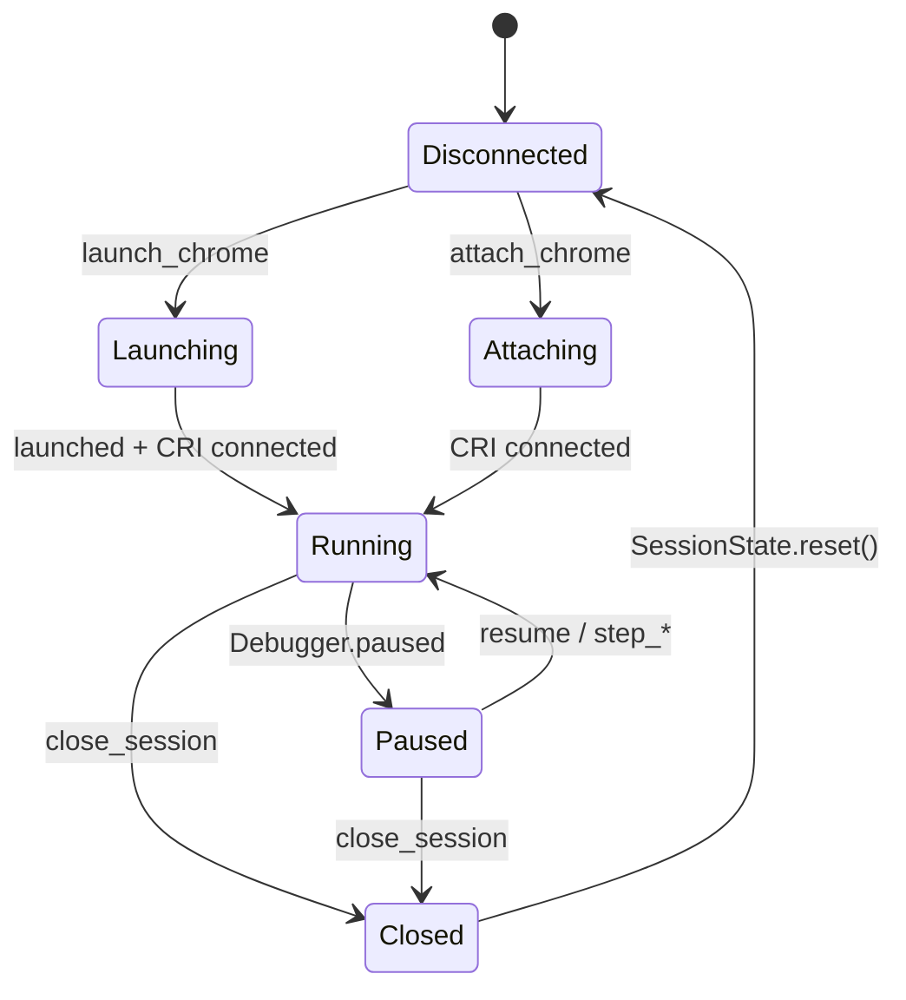

# src/session/

**Last updated: 2026-05-22**

Owns the singleton browser/Node process, the CDP client, pause state, and the buffered console + network streams. Every tool reads from this layer.

## Files

| File | Exports | Role |
|---|---|---|
| `state.ts` | `sessionState` (singleton), `SessionState`, `SessionKind`, `OwnedProcess`, `requireSession()`, `requirePaused()`, `requireCapable()`, `registerHandler()`, `getSession()`, `ROOT_SESSION_KEY`, `BreakpointRecord`, `BreakpointBinding` | The singleton holding everything else (CDP client, owned process, breakpoints map, `ScriptStore`, `PauseTracker`, ring buffers, per-session handler refs, `pauseOnExceptions` policy, session `kind`). The `sessionState.client` field is the injection seam L2 contract tests use to swap in `test/fake-cdp.ts`. |
| `capabilities.ts` | `TOOL_KIND_SUPPORT` | Per-tool kind allowlist consulted by `requireCapable()`. Browser is the default; only tools that reject a kind get an entry. See [`../tools/README.md`](../tools/README.md) §Capability gating for the agent-facing contract. |
| `browser.ts` | `launchChrome()`, `attachChrome()`, `switchTarget()` | Browser lifecycle. `chrome-launcher` for `launch_chrome`; `CDP({port,host})` for `attach_chrome`. Sets up `Target.setAutoAttach({ flatten: true })` so workers + iframes hit the same CRI client tagged with their own `sessionId`. |
| `node.ts` | `attachNode()`, `launchNode()` | Node Inspector lifecycle. `attach_node` connects to an existing `--inspect` / `--inspect-brk` process; `launch_node` spawns a Node child, parses the inspector port from stderr, attaches, and marks the process as owned for `close_session`. |
| `pause.ts` | `PauseTracker`, `PauseState` | One pause at a time. `waitForPause(timeout)` blocks until the next `Debugger.paused`; `waitForPauseOrResume(timeout)` is the step-tool variant. **Read the entry-guard comment on `waitForPauseOrResume`** — it is load-bearing for fast steps where CRI delivers the step response and the next pause in the same WebSocket batch. |
| `buffers.ts` | `RingBuffer<T>`, `ConsoleEntry`, `NetworkEntry` | Capped at 1000 entries each, monotonic `seq` for pagination. `RingBuffer.update()` is used by the network buffer when a response arrives for an in-flight request. |

## Session lifecycle

`close_session` (via `registry.closeAddressed` → `SessionState.close()`) kills Chrome or Node only if we launched it ourselves (`attached === false`); attach-mode sessions leave the user's process alive.

`launch_node` captures child stdout/stderr into a durable pull-based buffer (`sessionState.nodeOutput`) exposed via the `get_node_output` MCP tool. The buffer is deliberately separate from the V8-inspector console (`get_console_logs`), which captures `Runtime.consoleAPICalled` events from inside the debuggee process. `attach_node` sessions leave the buffer empty — lynceus doesn't own the stdio of a pre-existing process.

## Public surface tools rely on

- `requireSession(): SessionState` — throws `noSession()` if no client. Use in every tool.
- `requirePaused(): SessionState` — also throws `notPaused()`. Use for `get_scope`, `get_call_stack`, `evaluate` (with `frame_index`), and the step tools.
- `requireCapable(s, "<tool_name>"): void` — throws `unsupportedTarget()` when the active session's `kind` isn't in `TOOL_KIND_SUPPORT[<tool_name>]`. Call after `requireSession()` in every browser-only tool. Permissive when the tool isn't listed.
- `sessionState.client!.send(method, params, sessionId?)` — direct CDP call. **Always** pass through the `sessionId` that came from the source (script, frame, request) — see the provenance gotcha below.
- `sessionState.pause.current()` / `.isPaused()` — current pause state.
- `sessionState.scripts` (`ScriptStore`) — see [../sourcemap/README.md](../sourcemap/README.md).
- `sessionState.console.query({since, filter, limit})` and `sessionState.network.query(...)` — paginated reads; the `cursor` returned to callers is the max `seq` seen.

## Gotchas

- **`session_id` provenance.** `objectId`, `callFrameId`, `requestId`, and `scriptId` are all **per-Debugger/Runtime/Network agent** — i.e., per flat session. Two iframes can both emit `requestId="123"`. Every tool that returns one of these IDs also returns the originating `session_id` (`null` for root). Round-trip it on follow-ups or the call hits the wrong session. There is no "fall back to active pause session" behavior — omitting `session_id` always means root.
- **Pause race on fast steps.** See `pause.ts` `waitForPauseOrResume` comment — CRI emits events synchronously, so for a fast step the next `Debugger.paused` arrives before the step caller registers its waiter. The entry guard handles this; do not "simplify" it.
- **Auto-attach replay.** Newly-attached child sessions (worker, OOPIF) inherit `pauseOnExceptions` via the `set_pause_on_exceptions` replay path. Don't add per-session state without considering the replay surface.
- More depth → [../../docs/test-eval-plan.md](../../docs/test-eval-plan.md) §Critical gotchas (pause races, auto-attach replay, root↔child collision routing).
