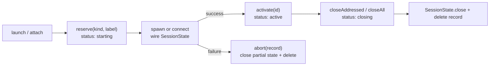
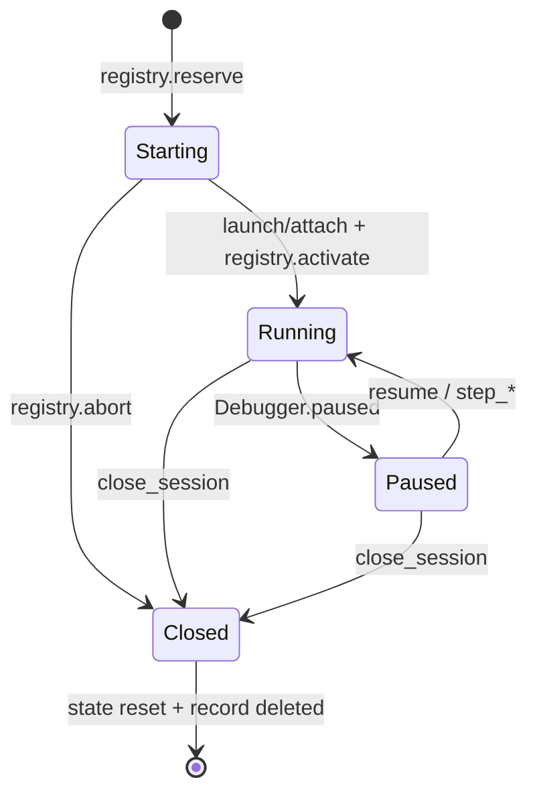

# src/session/

**Last updated: 2026-07-23**

Owns the debug-target registry and every target's mutable runtime state. A single
lynceus process can keep one browser session and one Node Inspector session live at
the same time; each record has its own CDP client, pause tracker, breakpoints, source
maps, console/network buffers, tracked pre-document scripts (browser only), and
(for launched Node children) stdout/stderr buffer. An opt-in React DevTools bridge
also keeps its lifecycle, document generation, and raw structural events on the
addressed browser session.

## Files

| File | Main exports | Role |
|---|---|---|
| `state.ts` | `registry`, `Session`, `SessionKind`, `SessionRecord`, `PreDocumentScriptSpec`, `PreDocumentScriptRecord`, `ReactBridgeState`, `requireSession()`, `requirePaused()`, `requireReactBridge()`, `requireCapable()`, `registerHandler()`, `unregisterHandler()`, `ROOT_SESSION_KEY` | `SessionRegistry` plus the per-target `SessionState`. The registry mints `browser_N` / `node_N`, enforces capacity and unique labels, resolves addresses, owns startup rollback and close fan-out, and allocates cross-session event sequence numbers. React bridge state and execution-context/frame provenance remain per target. |
| `capabilities.ts` | `TOOL_KIND_SUPPORT` | Per-tool kind allowlist consulted by `requireCapable()`. Shared Runtime/Debugger tools work on both kinds; browser-only and Node-only tools fail with `unsupported_target`. |
| `browser.ts` | `launchChrome()`, `attachChrome()`, `switchTarget()`, `addPreDocumentScript()`, `removePreDocumentScript()`, React binding helpers | Browser lifecycle. `Target.setAutoAttach({ flatten: true })` brings workers and iframes onto the same CRI client with their own CDP `sessionId`; tracked `Page.addScriptToEvaluateOnNewDocument` definitions and active React bindings replay onto new Page agents. Root frame loader IDs drive React's new-document generation. |
| `node.ts` | `attachNode()`, `launchNode()` | Node Inspector lifecycle. Launch mode owns the child, discovers its port from stderr, and captures stdio; attach mode leaves the external process alone. |
| `debugger.ts` | `connectDebugger()` | Shared Runtime + Debugger wiring, pause events, console buffering, source-map discovery, and execution-context provenance for either target kind. |
| `pause.ts` | `PauseTracker`, `PauseState`, `PauseWaitHandle` | One pause state per debug target. Supports scoped waits, cancellable registry races, resume synchronization, and fast-step pause detection. |
| `buffers.ts` | `RingBuffer<T>`, `ConsoleEntry`, `NetworkEntry`, `NodeOutputEntry`, `ReactBridgeEvent` | Four capped per-target buffers. All receive sequence numbers from one registry-global allocator; the public timeline currently merges console/network/Node output, while React `operations` remain internal input for RDT-2's materialized tree. |

## Registry model

The registry holds at most one record of each kind in v1: one browser plus one Node
session may coexist; a second browser or second Node session returns
`already_session`. IDs are monotonic for the process lifetime and never recycled.
Labels are optional, unique among live sessions, and descriptive only—tools accept the
ID returned by launch/attach or `list_sessions`, not a label.

Startup is transactional:

Reservations count against capacity. That prevents two concurrent launches from both
passing the guard, and it keeps a half-built target invisible to ordinary accessors.
`abort(record)` takes the record—not only its ID—so rollback can re-close state mutated
after a shutdown race removed the map entry.

Address resolution is intentionally convenient in the one-target case and strict in
the two-target case:

- `requireSession("browser_1")` resolves that active record or throws
  `unknown_session` with the current candidates.
- `requireSession()` resolves the sole active record, throws `no_session` for zero,
  and throws `ambiguous_session` for two.
- `requirePaused(session?)` applies the same resolution and then checks that target's
  `PauseTracker`.
- `list_sessions` returns the active records with `{ session, kind, label, attached,
  paused, url }`.
- `close_session({session})` closes one record. Omission closes the sole record but is
  ambiguous when both are live. Process shutdown calls `registry.closeAll()`.

## The two session axes

These names look similar but route at different layers:

| Input | Selects | Examples | Omitted value |
|---|---|---|---|
| `session` | A registry debug target | `browser_1`, `node_1` | Sole live target; ambiguous when two are live |
| `session_id` | A flat CDP child inside the chosen browser target | worker / iframe / OOPIF ID | Root CDP session (`null` and omission both mean root) |

Every CDP-minted `object_id`, `script_id`, `request_id`, and `call_frame_id` is scoped
to its Debugger/Runtime/Network agent. Round-trip both coordinates when a follow-up
needs them: `session` chooses the browser or Node record; `session_id` chooses the CDP
root/child within that record. Passing `browser_1` or `node_1` as `session_id` is a
validation error with a corrective message.

## Per-target lifecycle

`SessionState.close()` kills an owned Chrome/Node process only for launch mode
(`attached === false`). Attach mode closes the CDP socket and leaves the user's process
running. Launched Node children get an awaited SIGTERM grace period followed by a
SIGKILL fallback; close is memoized at the registry record so re-entrant teardown waits
on the same operation.

`launch_node` captures raw child stdout/stderr in `state.nodeOutput`. That is separate
from `state.console`, which records `Runtime.consoleAPICalled`; `attach_node` cannot see
the external process's stdio and therefore leaves the Node-output buffer empty.

`attach_react_devtools` installs the exact-pinned React backend before page code, then
waits for both a bootstrap sentinel and the first main-frame `operations` event. The
binding and tracked scripts persist across navigation; a changed main-frame loader ID
clears raw operations and advances only the document generation, while a BFCache restore
with the same loader retains it. Detach unsubscribes, removes registrations, clears the
buffer, and advances the attachment generation so late callbacks cannot cross epochs.
Attach and detach share one serialized lifecycle: teardown publishes cancellation before
its first CDP await, waits for already-issued registrations to settle or self-roll back,
and a concurrent reattach waits behind that cleanup barrier.

## Pauses and merged event order

Each target owns one `PauseTracker`:

- `wait_for_pause({session})` waits only on that target.
- Omitting `session` with two live targets races a cancellable waiter on the active
  participants snapshotted when the call starts. The first pause wins and losing
  waiters are removed immediately. An already-paused target may win at once.
- Closing a record resets its tracker before slow process teardown, rejecting its
  in-flight waiters promptly.
- Step tools use `waitForPauseOrResume()`. Its entry guard is load-bearing because CRI
  can emit the next `Debugger.paused` synchronously before the step call registers its
  waiter.

Console, browser-network request-start, and Node-output buffers stay per target, but
their `seq` values come from `registry.nextSeq()`. Specialized readers remain scoped;
`get_timeline(session="all")` projects retained rows from every live target into that
single total order. A timeline cursor is valid only while the same session/event-type
selection is retained.

## Public surface tools rely on

- Resolve once at the handler boundary: `const s = requireSession(input.session)`.
  Pass `s` into helpers rather than resolving again without an address.
- Use `requirePaused(input.session)` for pause-only tools and
  `requireCapable(s, toolName)` for kind-gated tools.
- Send CDP calls through `s.client!.send(method, params, sessionId?)`; preserve the
  originating CDP child `sessionId` where applicable.
- Read mutable state from that resolved record: `s.pause`, `s.scripts`,
  `s.breakpoints`, `s.preDocumentScripts`, `s.console`, `s.network`, and
  `s.nodeOutput`. Framework tools additionally use `s.reactBridge`,
  `s.reactEvents`, and `requireReactBridge(s)`.
- L2 tests create/activate registry records and inject `test/fake-cdp.ts` into the
  record's `client`; there is no process-global session-state injection slot.

## Gotchas

- **Do not resolve twice.** With two targets live, a helper that drops the already
  resolved `Session` and calls `requireSession()` again turns a valid addressed call
  into `ambiguous_session`—or, worse, acts on the wrong sole target after a close race.
- **Breakpoint IDs are per target.** `browser_1` and `node_1` can both mint `bp_1`.
  Round-trip the originating `session` on remove/wait logic.
- **Flat-session provenance is independent.** Omitted `session_id` always means root;
  it never falls back to the currently paused worker/iframe.
- **Auto-attach replay.** New browser child sessions inherit
  `pauseOnExceptions` and every tracked pre-document script. Any new
  per-CDP-session policy needs the same replay audit.
- **React frame scope.** V1 accepts React bridge messages only from the root
  agent's default execution context for the current main frame. A same-process
  iframe still shares the root flat CDP session, so filtering only by
  `session_id` is insufficient; preserve execution-context provenance.
- More depth: [dual-target-debugging.md](../../docs/dual-target-debugging.md) for the
  multi-session contract and [test-eval-plan.md](../../docs/test-eval-plan.md)
  §Critical gotchas for pause/source-map races.
