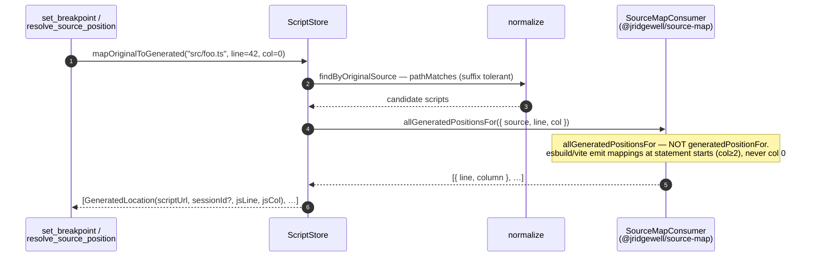

# src/sourcemap/

**Last updated: 2026-05-22**

Bridges TypeScript source coordinates (what the agent sends) and JavaScript script coordinates (what CDP speaks). Source maps are loaded lazily on every `Debugger.scriptParsed`.

## Files

| File | Exports | Role |
|---|---|---|
| `store.ts` | `ScriptStore`, `ScriptInfo`, `GeneratedLocation`, `mapCdpToOriginal()`, `mapOriginalToGenerated()`, `cdpToPublic()`, `publicToCdp()` | In-memory index of parsed scripts and their `SourceMapConsumer`s. Compound key: `sessionId + scriptId` (CDP `scriptId`s are per-Debugger-agent and collide across child sessions). |
| `loader.ts` | `buildScriptParsedHandler()`, `decodeDataUri()` | Pure factory returning a `Debugger.scriptParsed` handler — caller wires it via `registerHandler()`. Populates the store and fetches the source map. Fetch tier dispatches on `Session.kind`: **browser** sessions go through `Network.loadNetworkResource` (inheriting page auth / cookies / dev-server middleware) with a `fetch()` fallback for plain localhost; **node** sessions read `file://` URLs from disk via `fs.readFile(fileURLToPath(url))` (Node Inspector has no `Network` domain). Handles RFC 2397 multi-parameter `data:` URIs (webpack inline-source-map). |
| `normalize.ts` | `normalizeSourcePath()`, `pathMatches()` | Folds the messy URLs bundlers emit (`webpack:///`, `webpack-internal:///./`, `file:///`, `rollup://`, `vite-fs://`, …) to stable keys. `pathMatches` is suffix-tolerant so an agent's `src/foo.ts` matches a script whose map says `webpack:///./src/foo.ts`. |
| `original-source.ts` | `readOriginalSource()` | Retrieves the **original TS** text for a `file` fragment — the counterpart to `get_script_source` (compiled JS). Prefers the map's embedded `sourcesContent` (via `SourceMapConsumer.sourceContentFor`), then falls back to reading the `.ts` off disk for a **loopback** session (`tsc --sourceMap` emits `sources` but no `sourcesContent`). Reuses `store.pickSourceKey` + `loader.isLoopbackHost` so key selection and the file:// security gate match the rest of the module. Backs the `get_source` tool. |

## TS → JS translation

`mapCdpToOriginal` is the reverse path — used by every tool that returns a CDP frame (call stack, pause summary, console event with mapped line).

## Line/column numbering

Three coordinate systems, three offsets — get this wrong and breakpoints land on the wrong line.

| System | Lines | Columns |
|---|---|---|
| CDP (`Debugger.paused`, `setBreakpointByUrl`) | 0-based | 0-based |
| `@jridgewell/source-map` consumer | 1-based | 0-based |
| Public tool API (what agents see) | **1-based** | **0-based** |

Helpers `cdpToPublic()` / `publicToCdp()` are the only blessed places to convert.

## Gotchas

- **Use `allGeneratedPositionsFor`, not `generatedPositionFor`.** The latter requires an EXACT (line, column) match; esbuild/vite emit mappings only at statement starts. The L3 spec that surfaced this was a sample-app line whose mappings sat at columns 2 and 9 with nothing at column 0 (set_breakpoint default). See the in-source comment on `mapOriginalToGenerated`.
- **`url`, not `urlRegex`, on `Debugger.setBreakpointByUrl`.** CDP's regex is unanchored — `http://localhost/main.js` would also match `?v=2`, `?vue&type=template`, … and bind in every dev-server-cache variant.
- **HMR can leave stale source-map consumers.** `ScriptStore.upsert` preserves `consumer` on re-parse (intentional for soft reloads where the map URL is the same), but means HMR-changed maps leak until the next `close_session` clears the store. Authors of new tools that depend on map freshness: call `attachMap()` after any reload that might change the map.
- **`data:` URI source maps** must accept multi-parameter form (`data:application/json;charset=utf-8;base64,…`). The parser in `decodeDataUri` reflects an actual webpack regression — don't tighten it back to a single-parameter regex.
- **Source-map fetch path matters.** `loader.ts` prefers `Network.loadNetworkResource` for browser sessions so we go through the page's origin/CORS/auth context. The Node `fetch` fallback only works for plain localhost. For session-protected source maps the browser path is the one that actually has the cookies. Node Inspector sessions skip that entirely (no `Network` domain) and read `file://` URLs directly from disk — **only when `chromeHost` is loopback** (`null` / `127.0.0.1` / `::1` / `localhost`). Remote Node sessions explicitly refuse `file://` source maps; the path is on the remote machine and reading it locally would either fail or load the wrong file (and a malicious remote could trick the loader into reading attacker-chosen local paths).
- More depth → [../../docs/design-notes.md](../../docs/design-notes.md) "What the implementation discovered."
